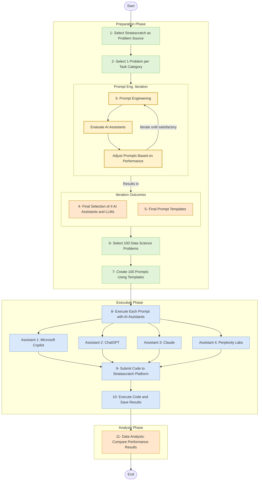

# LLM 4 Data Science

- [Project summary](#project-summary)
  - [The issue we are hoping to solve](#the-issue-we-are-hoping-to-solve)
  - [How our technology solution can help](#how-our-technology-solution-can-help)
  - [Our idea](#our-idea)
- [Presentation materials](#presentation-materials)
  - [Solution demo video](#solution-demo-video)
  - [Project development roadmap](#project-development-roadmap)
- [Additional details](#additional-details)
  - [How to run the project](#how-to-run-the-project)
  - [Live demo](#live-demo)

_INSTRUCTIONS: Below are the suggested sections to include in your README file to make sure your project is well documented. You can remove this instruction text._

## Project summary

### The issue we are hoping to solve

REPLACE THIS SENTENCE with a short description, 2-3 sentences in length, of the specific sustainability problem your solution is meant to address.

### How our technology solution can help

REPLACE THIS SENTENCE with a short description of your team's solution, in about 10 words.

### Our idea

INSTRUCTIONS: Replace this paragraph with a longer description of your solution. In about 500 words, describe your solution in more detail. Include the real-world problem you identified, describe the technological solution you have created, and explain how it’s an improvement over existing solutions. You can supply additional documentation in this source code repository that you link to as well.

More detail is available in our [description document](./docs/DESCRIPTION.md).

### Project development roadmap

## Additional details

_INSTRUCTIONS: The following deliverables are suggested, but **optional**. Additional details like this can help the judges better review your solution. Remove any sections you are not using._

### How to run the project

INSTRUCTIONS: In this section you add the instructions to run your project on your local machine for development and testing purposes. You can also add instructions on how to deploy the project in production.

### Live demo

You can find a running system to test at...

---
